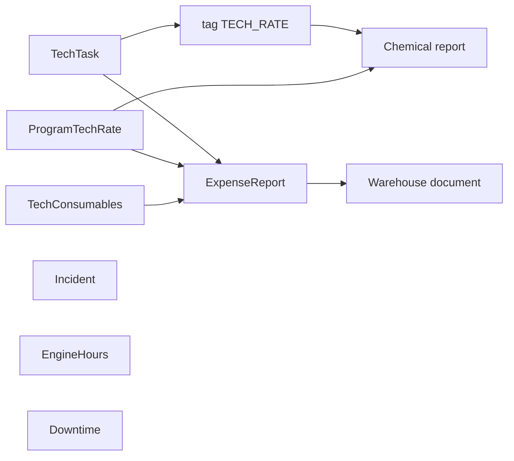

# Оборудование — как это работает

Сначала сценарий с точки зрения пользователя (формулировки бизнеса **как есть**). Затем — статусы, cron и формулы **как в коде**. Затем — расхождения (два подпункта, без сглаживания).

---

## Ответы бизнеса

- Пользователи: техники АМС и главные техники.
- Раздел: техобслуживание объектов.
- Техзадачи ставит главный техник. Разовые (произвольный текст) и регулярные.
  Можно набор заготовленных проверок. Теги; тег «Расход химии» включает задачу
  в расчёт химии. Техник заполняет ответ и отправляет на проверку.
  Главный техник может вернуть. Завершённую можно смотреть и вернуть в работу.
- Статусы: PAUSE — регулярная перестаёт создаваться автоматически;
  ACTIVE — не выполнена; RETURNED — вернули в работу; FINISHED — завершена;
  OVERDUE — просрочена.
- Регулярные создаёт cron от родительской задачи по алгоритму.
- Шаблоны: удобство регулярных задач + одинаковые поля для отчётов.
- Цепочки: спец. задачи + норма расхода = Расход химии;
  то же + расходники объекта = Отчёт по расходу. Остальные экраны независимы.
- Норму расхода ставит главный техник (коэффициенты объёма химии от времени работы).
  Отчёт химии видят все техники: факт программ + заполненные техзадачи.
  Информационный характер + график расхода/залива. Выводы делает техник.
- Расходники объекта: связь номенклатур склада с химией/запчастями объекта.
- Отчёт по расходу: после отправки ещё можно списать со склада указанное
  количество расходников. Статья финучёта НЕ создаётся. Списание = документ
  на соответствующем складе. Механика не как «SENT только вернуть».
- Поломка ≠ плановая задача. Заполняет техник объекта. Также работник объекта
  с доступом только к этой странице — спец. статус, техник проверяет.
  Поля создания (в т.ч. простой и т.д.) есть в форме. Закрывает техник объекта.
- Моточасы: главный техник задаёт лимиты и дату замены масла; наработка
  по времени программ; превышение помечается.
- Простой платежных устройств: только просмотр, алгоритм на сервере.

---

## Сценарий пользователя

### Роли

Главный техник ставит задачи, нормы, расходники, лимиты моточасов, может вернуть завершённую задачу и провести отчёт на склад. Техник АМС заполняет задачи, видит химию, работает с поломками объекта. Работник объекта с доступом только к поломкам — спец. статус: заявляет упрощённо, техник проверяет.

В seed роли с именем «Главный техник» нет: ближе **Техник кабинета** (description «Главный техник») и **Техник объекта**.

### Цепочки химия / отчёт



1. Спец. задачи (тег химии) + норма расхода → экран **Расход химии**.
2. То же + расходники объекта → **Отчет по расходу** → после отправки документ склада.
3. **Поломки**, **Моточасы**, **Простой платежных устройств** независимы.

### Задачи

1. **Список задач**: фильтры объекта, статуса, тегов, дат, исполнителя.
2. **Создать задачу**: название, комментарий автора, объект(ы), тип **Одноразовая** / **Многоразовая**, шаблоны, теги, для регулярной — периодичность.
3. Техник открывает карточку (модалка), вкладка **Ход выполнения**, заполняет шаблоны, **Завершить**.
4. Главный техник может **Вернуть в работу**. Завершённую можно открыть и вернуть.
5. **Приостановлена** на регулярной — следующие копии cron не создаёт.

### Поломки

1. Техник объекта: **Зафиксировать поломку** — полная форма (в т.ч. **Простой**).
2. Работник только этой страницы (спец. статус): **Заявить о поломке** — упрощённо; техник проверяет и закрывает.

### Моточасы и простой

Главный техник задаёт **Уставка масла** и **Предыдущая замена масла**. Наработка считается по программам; превышение лимита помечается. Простой платёжных — только таблица и фильтры, без создания.

---

## Связь сущностей (код)

- **TechTask** — документ задачи; пункты из `TechTaskItemTemplate`; теги M2M.
- **Родитель регулярной** — задача `REGULAR` с `templateToNextCreate=true`. После создания копии флаг у родителя `false`; новая задача становится следующим родителем.
- **Chemical report** — не отдельная таблица: GET chemistry-report по FINISHED-задачам с `code=TECH_RATE` и `ProgramTechRate`.
- **TechConsumables** — `nomenclatureId` + `posId` + тип химии/запчасти.
- **TechExpenseReport** — период + строки; склад через `COMMISSIONING`, `ManagerPaper` нет.
- **Incident** — не связан с TechTask.
- **EngineHours / Downtime** — расчёт по событиям устройств, не equipment-core сущности отчёта.

---

## Статусы и операции задач (код)

`StatusTechTask`: `ACTIVE`, `PAUSE`, `RETURNED`, `FINISHED`, `OVERDUE`. Явной state-machine нет: PATCH принимает любой enum.

| Операция | Когда | Эффект |
|----------|-------|--------|
| create | POST `/tech-task` | всегда `ACTIVE`; REGULAR: `templateToNextCreate=true`, `nextCreateDate` / `endSpecifiedDate` через PeriodCalculator |
| complete (shape) | POST `/tech-task/:id` | сразу `FINISHED`, `sendWorkDate`, `executorId` |
| return | PATCH `status=RETURNED` | отдельного endpoint нет |
| PAUSE | PATCH `status=PAUSE` | контроллер: `templateToNextCreate=false`; `nextCreateDate=null` |
| OVERDUE | cron | ACTIVE/RETURNED с `endSpecifiedDate` ≤ конец вчерашнего бизнес-дня |

Фильтр списка UI: ACTIVE, FINISHED, OVERDUE, RETURNED — **PAUSE в фильтре нет**.

Кнопка **Завершить** в карточке: право `read` или `manage` TechTask. **Вернуть в работу**: `update` или `manage`.

### Cron регулярных

Ежедневно `00:00`, TZ `TECH_TASK_BUSINESS_TIMEZONE` (иначе конфиг, default UTC). Выборка: `REGULAR` + `templateToNextCreate=true` + `nextCreateDate` ≤ конец бизнес-дня + есть `periodType`. Антидубль за день: `name` + `posId` + `periodType` + `customPeriodDays`. Копия items и tags.

PAUSE: задача не попадает в выборку cron.

---

## Формулы химии и отчёта (код)

Тег химии в коде: `TECH_RATE`, не строка имени. Нужно **≥ 2** FINISHED-задач с этим кодом за период (`endSpecifiedDate`; dateStart сдвигается на −1 день).

```
spent = oldLevel - currentLevel + oldAdd   // кроме SALT
spent = value(SALT)                        // только текущий отчёт
coef  = literRate / concentration          // ProgramTechRate; Portal → coef 0
seconds = сумма пересечений program events с периодом
min = round(100 * seconds / 60) / 100
recalculation = round(100 * min * coef) / 100
```

Нормы в БД хранятся `*100`; API отдаёт /100.

Отчёт по расходу (строка):

```
quantityAtStart = quantityAtEnd предыдущего SENT (или 0)
quantityByReport = spent химии по type (для SPARE_EQUIPMENT = 0)
quantityWriteOff = clamp(quantityOnWarehouse - calculationQuantityOnWarehouse, 0..quantityOnWarehouse)
```

Create → `CREATED`; recalculate → `SAVED`; send → `SENT`. Return только SENT → SAVED. Delete SENT нельзя.

После SENT: **Провести на складе** (`COMMISSIONING` по `quantityWriteOff > 0`) и **Вернуть**. Это правило продукта, не аналогия с инкассацией. После `isWriteOffFromWarehouse=true` в UI остаётся **Отменить проведение по складу**.

---

## Инцидент, моточасы, простой (код)

| Сценарий | Статус |
|----------|--------|
| POST `/incident` (полная форма) | default prisma **RESOLVED** (status в DTO не передаётся); ability **update** |
| POST `/incident/simple` | **NEW**; ability **create** |
| PATCH `/incident` | всегда **RESOLVED** |

`Incident.downtime` — ручное поле формы. К GET `/device/downtime` не относится.

Моточасы: устройства `WASHER`. Pump v1 коды SOAP, WATER; v2 — SOAP, TIRE, PRESOAK, BRUSH, WATER, WAX, OSMOS. `oilRunHours` от `lastOilChangeDate` до сегодня 23:59. UI красит `oilRunHours > oilLimit`. Query `excess` бэк **не фильтрует**. Поле `oilRunHoursPump` фронт показывает, бэк **не отдаёт**.

Простой: только GET. Lookback 60 дней, gap > 12 ч, соседи на POS. Типы: `COIN`, `PAPER`, `POS`, `DEVICE`.

---

## Принятые правила продукта

Это **один** раздел. Двух ожиданий по пунктам ниже нет.

| Код | Правило |
|-----|---------|
| **P1** | После отправки отчёта по расходу списание со склада ещё можно. Не сравнивать с инкассацией («SENT только Вернуть»). Статья финучёта не создаётся. Документ склада — `COMMISSIONING` / «Передача в эксплуатацию». |
| **P2** | Поломка ≠ техзадача. Полную форму заполняет техник объекта. Работник с доступом только к этой странице — спец. статус; техник проверяет. |

---

## Расхождения (два подпункта)

Не сглаживать: продукт и код — разные утверждения.

### 1. Отправка задачи «на проверку»

1. **Продукт:** техник заполняет ответ и отправляет на проверку; главный техник может вернуть.
2. **Код:** **Завершить** сразу ставит `FINISHED` (`POST /tech-task/:id`). Промежуточного статуса нет. Вернуть = PATCH `RETURNED` (нужен `update` TechTask).

### 2. Тег «Расход химии»

1. **Продукт:** тег «Расход химии» включает задачу в расчёт химии.
2. **Код:** отбор по `TechTaskTag.code = TECH_RATE`, не по имени. Seed тега нет. Имя в UI любое.

### 3. Работник «только поломки»

1. **Продукт:** работник объекта с доступом только к этой странице — спец. статус, техник проверяет.
2. **Код:** отдельной роли и `UserStatus` под это нет. Упрощение = `POST /incident/simple` + `NEW`. Кнопка **Заявить о поломке** при `create` Incident. Кнопка **Зафиксировать поломку** при `update`.

### 4. Статус полной поломки при создании

1. **Продукт:** техник проверяет заявление и закрывает поломку.
2. **Код:** полный POST сразу `RESOLVED`. Simple — `NEW`. PATCH всегда `RESOLVED`.

---

## Оставшиеся факты кода

Не путать с конфликтами выше.

| Тема | Факт |
|------|------|
| Роли seed | «Главный техник» как name нет; **Техник кабинета** / **Техник объекта** |
| `/tech-task/me` | список по POS из прав пользователя, не «только свои как исполнитель» |
| Chemistry / rate / expense UI | subject **Incident**, хотя feature backend часто **TechTask** |
| Повторное списание отчёта | UI: кнопки склада нет, если уже проведено. API: проверка `status != SENT && isWriteOffFromWarehouse` — повторный POST на уже SENT+проведённом этой проверкой **не** режется |
| `excess` моточасов | уходит с фронта, use-case не использует |
| `oilRunHoursPump` | колонка UI есть, в ответе backend нет |
| PAUSE в фильтре списка | нет |
| `/equipment/technical/tasks/list/item` | в роутере есть, переходов из списка нет |
