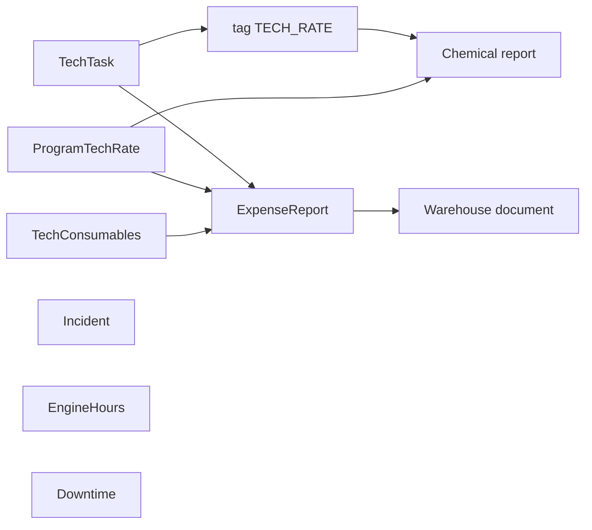

# Оборудование — обзор для QA

В файлах `01`–`08`: сначала блок **«О странице»** (зачем / что менеджерит), затем тест-кейсы **Шаг → Действие → Ожидаемый результат**.

## Назначение раздела

Раздел **Оборудование** в админке Onvi Business — контур **техобслуживания объектов**: техзадачи, расход химии, нормы, расходники, отчёт по расходу, поломки, моточасы, простой платёжных устройств.

Корневой пункт `/equipment` требует план **BUSINESS | CUSTOM**. Доступ в меню — **OR** по правам: достаточно одной пары action+subject из списка родителя (`Incident`, `TechTask`). `manage` закрывает любой action того же subject.

Дочерние экраны сужают subject:

| Экраны | Subject |
|--------|---------|
| Технические задачи, список задач | `TechTask` |
| Расход химии, норма расхода, расходники, отчёт по расходу, моточасы, простой устройств | `Incident` (`manage` или `read`) |
| Поломки оборудования | `Incident` (`manage` / `create` / `read` / `update`) |

На backend дополнительно: feature `Incident` и/или `TechTask` (где контроллер это проверяет). Отдельного subject **Equipment** нет.

## Источники домена

| Слой | Путь |
|------|------|
| Frontend UI | `onvi-monitoring-frontend/src/pages/Equipment/` |
| Frontend API | `src/services/api/equipment/index.ts` |
| Backend | `C:\Bychenko\monitoring-system-backend` → `src/app/platform-user/core-controller/incident.ts`, `equipment.ts`, `techTask.ts`, `techExpense.ts`, `device.ts`; `src/core/equipment-core/` |

## Жизненный цикл (как связаны сущности)

1. Главный техник ставит **техзадачи** (разовые и регулярные), шаблоны пунктов и теги.
2. Задачи с тегом химии (`code = TECH_RATE`) + **норма расхода** дают **Расход химии**.
3. Те же задачи + нормы + **расходники объекта** дают **Отчет по расходу**; после отправки можно списать на склад (документ, не статья учёта).
4. **Поломки** (`Incident`) — отдельный контур, не плановая задача.
5. **Моточасы** и **простой платежных устройств** — отдельные экраны.

## Словарь сущностей

| Сущность | Простыми словами | Backend (ориентир) |
|----------|------------------|-------------------|
| **Объект (АМС)** | Мойка / филиал | `Pos` |
| **Техзадача** | Разовая или регулярная работа на объекте | `TechTask` |
| **Тип задачи** | Одноразовая / многоразовая | `TypeTechTask`: `ONETIME`, `REGULAR` |
| **Шаблон пункта** | Заготовленная проверка / поле отчёта | `TechTaskItemTemplate` |
| **Тег** | Метка задачи | `TechTaskTag` (`name`, optional `code`) |
| **Тег химии** | В расчёт химии задача попадает по **`code = TECH_RATE`** | константа `TECH_RATE_CODE` |
| **Родитель регулярной** | REGULAR-задача с `templateToNextCreate=true`; отдельной сущности шаблона расписания нет | `templateToNextCreate`, `nextCreateDate`, `periodType` |
| **Поломка** | Инцидент на объекте, не техзадача | `Incident` |
| **Simple incident** | Урезанное заявление: объект, сотрудник, дата, комментарий; статус `NEW` | `POST /incident/simple` |
| **Норма расхода** | Коэффициенты объёма химии от времени программ | `ProgramTechRate` |
| **Расходник объекта** | Связь номенклатуры склада с типом химии/запчасти объекта | `TechConsumables` |
| **Отчёт по расходу** | Документ за период по расходникам объекта | `TechExpenseReport` + `TechExpenseReportItem` |
| **Списание из отчёта** | Складской документ `COMMISSIONING` | event `warehouse-document.send-tech-expense-report` |
| **Моточасы** | Лимит масла, даты замены, наработка по программам | `DeviceTechParams`, GET engine-hours |
| **Простой платежных** | Расчёт простоя каналов/поста | GET `/device/downtime` (отдельной модели нет) |

## Доступы

### План подписки

`requiredPlanCodes: ['BUSINESS', 'CUSTOM']`.

### Permissions

| Action | Типичное использование |
|--------|------------------------|
| `read` | Списки задач, химия, нормы, расходники, отчёт, моточасы, простой, поломки; **Завершить** задачу (`read` или `manage` на TechTask) |
| `create` | Создание задачи; **Заявить о поломке** (simple); добавить расходник |
| `update` | Правка/PAUSE/возврат задачи; **Зафиксировать поломку** и закрытие инцидента; сохранить нормы; пересчёт/отправка/склад отчёта |
| `delete` | Удаление задачи; удаление отчёта (не SENT) |
| `manage` | Закрывает любой action того же subject |

Кнопка **Сохранить** на норме расхода: `manage` или `update` на `Incident`. Удаление расходников на UI **без** `Can`.

### Feature flags (backend)

| Контур | Feature |
|--------|---------|
| incident, equipment pos/incident-info | `Incident` |
| tech-task, chemistry-report, rate, tech-expense, engine-hours, downtime | `TechTask` |

## Организация и данные

Списки часто фильтруются объектами из прав пользователя (`posId` в ability). Без выбранной организации и без объекта списки часто пустые — это не обязательно баг API.

## Query-параметры (сквозные)

| Param | Где | Зачем |
|-------|-----|-------|
| `page`, `size` | задачи, отчёт, моточасы, простой | пагинация |
| `posId` | химия, задачи, нормы, поломки, расходники, отчёт | объект |
| `city` | химия, нормы, поломки | площадка |
| `dateStart`, `dateEnd` | химия, поломки, отчёт, моточасы, простой | период |
| `status` | список задач | фильтр статуса |
| `name`, `tags`, `assigned` | список задач | поиск, теги (csv **имён**), исполнитель → API `executorId` |
| `type` | расходники | `TechConsumablesType` |
| `id` | edit отчёта | id отчёта |
| `cityIds`, `posIds` | моточасы, простой | мультифильтр |
| `excess` | моточасы | фильтр UI «Превышение» |
| `downtimeType` | простой | `COIN` / `PAPER` / `POS` / `DEVICE`; дефолт `COIN` |

## Статусы (ориентиры)

| Объект | Статусы |
|--------|---------|
| TechTask | `ACTIVE` «Действующий» (в модалке «Активная»), `PAUSE` «Приостановлена», `RETURNED` «Возвращена», `FINISHED` «Выполнено» (в модалке «Завершена»), `OVERDUE` «Просрочено». Тип: `ONETIME` «Одноразовая», `REGULAR` «Многоразовая» |
| Incident | `NEW` «Новый», `RESOLVED` «Решен» |
| TechExpenseReport | `CREATED` «Создано», `SAVED` «Сохранено», `SENT` «Отправлено» |

## Навигация

- **Сайдбар:** Расход химии, Технические задачи (Список задач), Норма расхода, Поломки оборудования, Расходники объекта, Отчет по расходу, Моточасы, Простой платежных устройств. Заголовок группы: **Ежедневные параметры тех.службы**. Перед поломками — секция **ОтЧЕТЫ**.
- **Только по URL / из списка:** карточка отчёта `/equipment/expense-report/edit`.
- **В меню нет:** `DailyReports`, `TechTaskCreate`, `TechTaskDetails`, заглушка `Equipment.tsx`.

## Рекомендуемый порядок smoke

1. Техзадачи с тегом химии → 2. Нормы → 3. Расход химии.  
4. Задачи + нормы + расходники → отчёт по расходу → списание на склад.  
5. Поломка.  
6. Моточасы.  
7. Простой платежных устройств.
