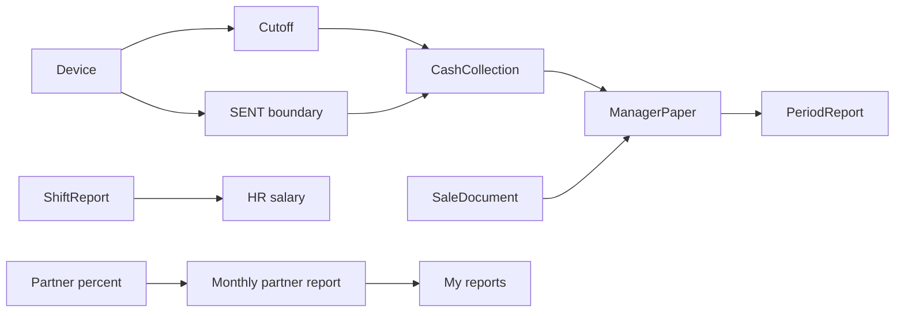

# Управление — как это работает

Сначала сценарий с точки зрения пользователя (формулировки бизнеса **как есть**). Затем — статусы и формулы **как в коде**. Затем — принятые правила продукта и оставшиеся факты кода.

---

## Ответы бизнеса

- Пользователь: управляющий АМС; страницы для контроля объекта и отчётов.
  Статьи заполняет главный менеджер на этой АМС.
- Порядок инкассации: физически снять деньги → отсечка (необязательно) →
  создать инкассацию → проверить расчёт и метки → внести факт → отправить.
- Объект = несколько устройств. У каждого устройства две временные отсечки;
  за этот промежуток берутся операции.
- Отсечка: время снятия денег с устройства, дубль действия на железе.
  Не обязательна. Можно много раз; старые метки в БД; нужна последняя.
  Нет отсечек → текущая дата, её можно править.
  Предыдущая граница всегда из последней ОТПРАВЛЕННОЙ инкассации.
- Инкассация: сколько должно было прийти по зачислениям и сколько забрали фактически.
  Всё кроме факта — автоматически. Недостача = факт минус «должно быть», только нал.
  После отправки нельзя редактировать, пересчёт SENT нет.
  SENT не пересекаются по времени (сервер). Нельзя создать раньше даты последней SENT.
- Инкассация — вариация статьи. При отправке — нередактируемая статья.
  Удалить статью можно только если вернуть эту инкассацию.
- Фин учёта: приход/расход вручную. Чек и комментарий необязательны.
  Автостатьи из других документов, меняются только через эти документы.
  Справочник — при особых правах.
- Отчёт за период: по ПОЛЬЗОВАТЕЛЮ, не по АМС; у пользователя несколько объектов.
  Все его статьи + деньги на начало и сколько осталось.
  Отправка фиксирует; возврат снова можно править статьи. Пустой отчёт бывает — норма.
- Продажа тоже автостатья, не дублировать. Табель на статьи не влияет.

Дополнительно по экранам раздела:

- Пользователь Управления — управляющий АМС. Исключение — партнёры: партнёры и финансисты. **Мои Отчеты** — роль партнёра, только свои объекты и своя прибыль.
- Табель: отчёт смен для HR. День + АМС + работник + тип смены. В логику ЗП идёт только **рабочий день**; остальные типы — отметки. Отработал → оценка → бонус в ЗП. Ввод денег: только размен и возврат. Порядок: создать → оценка → кассовые операции если есть → отправить. SENT как у инкассации: только вернуть. Сам в ЗП не уходит; ЗП/аванс берут **отправленные** смены. Уволенный не в Select — достаточно; серверный запрет не требовать.
- Продажа: товары. Только номенклатура с остатком на объекте **и** ценой (Склад → Цены для продажи). Склад, менеджер, ≥1 строка. Проведение → нередактируемая статья. Возврат = снять статью. Без возврата нельзя править/удалить проведённое.
- Отладка: управляющий или техник объекта. Ложные зачисления: алгоритм по зачислениям объекта, возможные ошибки; удалить, чтобы не считались в статистике и документах. Файл операций: данные не дошли с железа; грузит техспециалист объекта.
- Партнёры: выручка объекта и доля партнёра. Проценты задают один раз; новый отчёт берёт текущее состояние. Раз в месяц: доход/расход + excel; расчёт сохраняется. Смена процентов **не** пересчитывает уже сохранённые отчёты. Для пользователя доли = 100%. Редкие исключения — только разработчик, **не продуктовые ТК**.

---

## Сценарий пользователя

Управляющий работает с **объектом** (несколько устройств). Главный менеджер на этой АМС заводит ручные статьи.

Типовой день инкассации:

1. Физически снять деньги с устройств.
2. По желанию поставить **отсечку** на устройствах (кнопка «Проинкассировал» на экране **Отсечки**). Можно не ставить.
3. **Создать инкассацию** (меню **Инкассация** → **Создать**): объект + дата → **Сформировать**.
4. Проверить автоматический расчёт и границы времени по устройствам.
5. Внести **факт** (монеты / купюры по типу устройств).
6. **Пересчитать**, затем **Пересчитать и отправить**.

После отправки в **Статьях** появляется приход «Инкассация». Его нельзя править вручную. Единственное действие с отправленной инкассацией — **Вернуть** (после возврата снова можно править и отправить).

По итогам периода тот же человек (не «объект») открывает **Отчет за период**, видит свои статьи по всем объектам, суммы на начало и сколько осталось. Пустой период — норма. **Отправить** фиксирует; **Вернуть** снова открывает правки статей.

### Табель

1. **Табель учета рабочего времени**: объект + период → календарь смен.
2. Создать смену: работник, границы, тип дня.
3. Для **Рабочий день**: открыть смену → **Оценка смены** → при необходимости **Размен** / **Возвраты** → **Отправить**.
4. После отправки только **Вернуть**.
5. **Выходной** / **Отпуск** / больничный / отгул / прогул — отметки, в ЗП не входят.
6. Вкладки **Уборка** и **Подозрительные опреации** — просмотр из кода; бизнес как ввод их не описывал.
7. Связь с HR: расчёт ЗП/аванса берёт SENT-смены с типом рабочий день, не сам табель.

### Продажа

1. **Продажа** → создать документ: склад, менеджер, позиции с остатком и ценой.
2. Сохранить = провести: складское списание + автостатья «Продажа».
3. Без **Вернуть** править и удалить нельзя. Возврат снимает статью и документ.

### Отладка

1. **Ложные зачисления**: объект + даты → устройства с подозрительными операциями.
2. Открыть устройство → отметить ложные → удалить: операций нет в статистике и документах.
3. **Загрузка файла с операциями**: техник объекта загружает сырой файл (данные не дошли с железа). С ложными не связан.

### Партнёры

1. **Процент объектов**: задать доли (в UI сумма **100%**).
2. **Расчет прибыли**: раз в месяц доходы/расходы + excel; расчёт сохраняется с текущими процентами.
3. Смена процентов не меняет уже сохранённый отчёт.
4. **Мои Отчеты**: только объекты и прибыль текущего пользователя.

---

## Связь сущностей (код)

- **Cutoff** — последняя `CarWashDeviceEvent` с `carWashDeviceEventTypeId = 9`.
- **SENT boundary** — `tookMoneyTime` устройства в последней инкассации со статусом `SENT` (по `sendAt`).
- **CashCollection** — документ по POS; строки устройств + итоги по типам.
- **ManagerPaper** — статья учёта; авто из send инкассации (имя типа «Инкассация», group `REVENUE`) и из проведения продажи (тип «Продажа»).
- **PeriodReport** — `ManagerReportPeriod` с ключом `userId`.
- **ShiftReport** — смена; в HR выплату идут SENT + тип рабочий день, не сам документ табеля.
- **Partner percent → monthly report → My reports** — текущие доли на новый отчёт; `/me` только свои объекты.

---

## Статусы и операции инкассации (код)

`StatusCashCollection`: `CREATED` → сразу `SAVED` после расчёта; `SENT` после send.

| Операция | Когда можно | Эффект |
|----------|-------------|--------|
| create | дата документа **строго позже** `cashCollectionDate` последней SENT по POS | создаёт SAVED, считает суммы |
| recalculate | не SENT | пересчёт, статус SAVED |
| send | не SENT | тот же пересчёт + SENT + emit статьи |
| return | только SENT | SENT → SAVED, emit удаления статей по `cashCollectionId` |
| delete | не SENT | удаление документа |

Пересчёта уже SENT **нет**: и recalculate, и send режутся одной проверкой статуса.

Границы на устройстве при **create**:

- нижняя `oldTookMoneyTime` = `tookMoneyTime` последней SENT по устройству, иначе **вчера 05:00**;
- верхняя `tookMoneyTime` = max отсечки type 9, иначе **сегодня 05:00**.

При **recalculate/send**: нижняя с последней SENT того же device с датой инкассации `< текущей` (поле клиента игнорируется, если SENT есть); верхняя из формы. Проверки «нет отсечки → нельзя менять» нет.

Отсечка: каждый POST — **новая** запись события; GET отдаёт последнюю. UI шлёт `new Date()`, произвольную дату выбрать нельзя.

Табель: те же статусы SAVED/SENT; send / return те же по смыслу (после send только **Вернуть**). Create сразу SAVED. UI CREATED не показывает.

Продажа: отдельного статуса нет; POST create = проведение.

---

## Формулы сумм (код)

Интервал операций: `[oldTookMoneyTime, tookMoneyTime]` на каждом устройстве.

| Поле | Что это |
|------|---------|
| `sum` / `sumCoin` / `sumPaper` устройства | нал (монеты/купюры) за интервал |
| `virtualSum` | операции с currencyView **POS** |
| `sumCard` | безнал за интервал |
| `sumFact` типа | **ввод** монет + купюр |
| `shortage` типа | `Σ device.sum − sumFact` (расчётный нал минус факт) |

Шапка: агрегаты типов; `sumCard` = сумма устройств; `averageCheck = (sumFact + virtualSum) / countCar`.  
Список: `sumVirtual` = `virtualSum`; `profit = sumFact + virtualSum`.  
В карточке `sumCard` в шапке **не показывается**.

Недостача в коде считается **только по налу**. `sumCard` и `virtualSum` в `shortage` **не входят**.  
**Положительная недостача** = забрали меньше, чем насчитано (факт < расчётного нала).

---

## Статьи и период (код)

- Ручная статья: группа, объект, тип, дата, сумма, пользователь; чек и комментарий необязательны.
- Автостатья инкассации: не HTTP «Статьи», а событие send. `paperTypeId` **64** (seed «Инкассация») и **67** нельзя выбрать чекбоксом / править в UI. Удаление автостатьи штатно через **return** инкассации (продажа — через return документа продажи).
- Период: статусы `SAVE` / `SENT`. Send только меняет статус (снимок статей не делается). Return → `SAVE`. Delete периода нельзя в SENT.
- Create/update статьи: если `eventDate` попадает в SENT-период **этого userId** — ошибка.
- Удаление **ручной** статьи, пока период SENT: **нельзя**. Если DELETE всё же проходит — **баг A4**.
- Список периода: пункты send/return в меню **есть**, API **не вызывают**. Send/return работают на `/finance/report/period/edit`.
- Период **без** `posId`: все статьи пользователя за даты, в том числе с нескольких объектов.

---

## Принятые правила продукта

Это **один** раздел. Двух ожиданий по пунктам ниже нет.

| Код | Правило |
|-----|---------|
| **A1** | После отправки инкассации или табеля действие одно — **Вернуть**. Править SENT нельзя; пересчёта SENT нет. |
| **A2** | Нет отсечки → границы **05:00** (верхняя сегодня, нижняя без SENT — вчера). Это правило продукта, не расхождение. Даты на карточке можно править. |
| **A3** | Положительная недостача = забрали меньше, чем насчитано. Формула: расчётный нал − факт; карта и virtualSum в недостачу не входят. |
| **A4** | Удалять ручную статью, пока период SENT — нельзя. Если код удаляет — баг (два подпункта ниже). |

### Баг A4 (два подпункта)

1. **Продукт:** удаление ручной статьи с датой внутри SENT-периода этого пользователя должно быть запрещено.
2. **Код:** DELETE статьи проверку SENT-периода **не** делает. Если удаление проходит — это **баг**, не допустимое поведение.

---

## Оставшиеся факты кода

Не путать с A1–A3: это не «два ожидания продукта».

| Тема | Факт |
|------|------|
| Пересечение SENT на send | На create проверяется только дата документа vs последняя SENT. На recalculate/send проверки пересечения интервалов устройств **нет** |
| Справочник | UI: `manage` **или** `update` ManagerPaper; backend типа — `update`; delete типа нет |
| Отправка периода | только статус SENT; статьи не «замораживаются» отдельным снимком |
| Список периодов send/return | пункты меню без вызова API |
| DELETE смены | UI на SENT скрывает удаление; API может не проверять SENT |
| Create/view продажи | `permissions: []` на маршруте |
| Группа партнёров | path группы = `/finance/debugging` (как у Отладки) |
