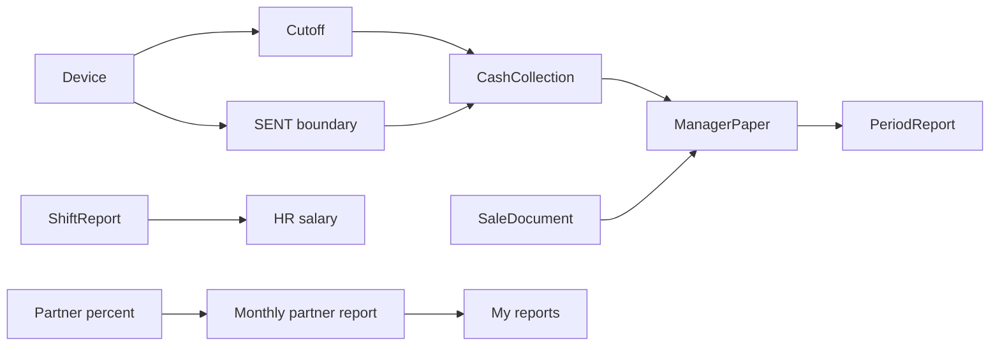

# Управление — обзор для QA

В файлах `01`–`09`: сначала блок **«О странице»** (зачем / что менеджерит), затем тест-кейсы **Шаг → Действие → Ожидаемый результат**.

## Назначение раздела

Раздел **Управление** в админке Onvi Business — операционный контур **денег и смен объекта**: инкассация, отсечки, статьи, отчёт за период, табель, продажа, отладка операций, расчет с партнерами.

Корневой пункт `/finance` требует план **SPACE | BUSINESS | CUSTOM**. Доступ в меню — **OR** по правам: достаточно одной пары action+subject из списка родителя (`CashCollection`, `ShiftReport`, `ManagerPaper`, `Pos`, `PartnerReport` на дочерних группах). `manage` закрывает любой action того же subject.

Дочерние экраны сужают subject:

| Экраны | Subject |
|--------|---------|
| Инкассация, Отсечки | `CashCollection` |
| Статьи, справочник, отчет за период, список продажи | `ManagerPaper` |
| Табель | `ShiftReport` |
| Отладка | `Pos` |
| Расчет с партнерами | `PartnerReport` |

На backend дополнительно: feature `CashCollection` / `ManagerPaper` / `ShiftReport` (где контроллер это проверяет).

## Источники домена

| Слой | Путь |
|------|------|
| Frontend UI | `onvi-monitoring-frontend/src/pages/Finance/` |
| Frontend API | `src/services/api/finance/index.ts`, `sale/index.ts`, `pos/index.ts`, `deviceDataRawFile.ts` |
| Backend | `C:\Bychenko\monitoring-system-backend` → `src/app/platform-user/core-controller/finance.ts`, `managerPaper.ts`, `sale.ts`, `finance-partner.ts`; `src/core/finance-core/cashCollection/`; `src/core/manager-paper-core/` |

## Жизненный цикл (как связаны сущности)

1. На устройстве (опционально) ставят **отсечку** — событие type 9; в расчёт инкассации берётся **последняя**.
2. Создают **инкассацию** по объекту: сервер берёт операции между двумя границами на каждом устройстве.
3. Вносят **факт** наличных, пересчитывают, **отправляют**. После отправки единственное действие — **Вернуть**.
4. При отправке появляется **статья** «Инкассация» (`ManagerPaper`); править её вручную нельзя.
5. Статьи пользователя за даты попадают в **отчет за период** (ключ — `userId`, не объект).
6. **Табель** не пишет статьи; в HR ЗП/аванс берутся SENT-смены типа **Рабочий день**.
7. **Продажа** при проведении сама создаёт статью.
8. **Партнёры:** проценты → месячный отчёт (excel) → **Мои Отчеты** (только свои объекты).

## Словарь сущностей

| Сущность | Простыми словами | Backend (ориентир) |
|----------|------------------|-------------------|
| **Объект (АМС)** | Мойка / филиал | `Pos` |
| **Устройство** | Пост/аппарат на объекте | `CarWashDevice` |
| **Инкассация** | Документ: сколько должно прийти и сколько забрали | `CashCollection` |
| **Строка устройства** | Две границы времени и суммы по устройству | `CashCollectionDevice` |
| **Итог по типу** | Факт монет/купюр, virtualSum, недостача по типу | `CashCollectionDeviceType` |
| **Отсечка** | Метка «сняли деньги» на железе | `CarWashDeviceEvent` typeId **9** (отдельной таблицы нет) |
| **Статья** | Приход или расход в учёте управляющего | `ManagerPaper` |
| **Тип статьи** | Справочник: имя + RECEIPT / EXPENDITURE | `ManagerPaperType` |
| **Отчет за период** | Срез статей пользователя за даты + суммы начала/конца | `ManagerReportPeriod` |
| **Смена (табель)** | День работника на объекте | `MNGShiftReport` |
| **Продажа** | Документ списания товара со склада | `MNGSaleDocument` |
| **Ложные зачисления** | Эвристика ошибочных операций устройства | `false-operations` (отдельной сущности нет) |
| **Расчёт партнёров** | Доли объекта и месячный отчёт прибыли | `PosCalculation`, `PosPartnerPercent`, `PosPartnerReport` |

## Доступы

### План подписки

`requiredPlanCodes: ['SPACE', 'BUSINESS', 'CUSTOM']`.

### Permissions

| Action | Типичное использование |
|--------|------------------------|
| `read` | Списки инкассаций, отсечек, статей, периодов, табеля, продаж, ложных, «Мои Отчеты» |
| `create` | Создание инкассации, отсечки, статьи, периода, смены, продажи, процентов/отчёта партнёра; send инкассации, периода, смены |
| `update` | Возврат инкассации, периода, смены; типы справочника; доли партнёров |
| `delete` | Удаление SAVED-инкассации; массовое удаление статей; удаление периода SAVE; удаление ложных операций (Pos) |
| `manage` | Закрывает любой action того же subject |

Справочник на UI: кнопка добавить/править при `manage` **или** `update` на `ManagerPaper`. На backend create/update типа — `@CheckAbilities(UpdateManagerPaperAbility)` (`update`). Delete типа **нет**.

Create/view продажи: на маршруте **permissions пустые** (прямая ссылка не режется CASL маршрута).

### Feature flags (backend)

| Контур | Feature |
|--------|---------|
| cash-collection, time-stamp | `CashCollection` |
| manager-paper (статьи, типы, период) | `ManagerPaper` |
| shift-report | `ShiftReport` |

## Организация и данные

Список инкассаций уходит с `organizationId` из сессии. Без выбранной организации списки часто пустые — это не обязательно баг API. Период и статьи фильтруются по **пользователю** (`userId`), не по АМС.

## Query-параметры (сквозные)

| Param | Где | Зачем |
|-------|-----|-------|
| `page`, `size` | списки | пагинация |
| `posId` | инкассация, отсечки, статьи, табель, ложные, партнёры | объект |
| `city` | инкассация, отсечки, статьи, период edit, табель, партнёры | площадка / имена POS |
| `dateStart`, `dateEnd` | инкассация, статьи, период, табель, продажа, ложные, отчёты партнёров | период фильтра |
| `id`, `status` | creation инкассации | карточка; `status` часто уже **перевод** (`Отправлено`) |
| `group`, `paperTypeId`, `userId` | статьи | фильтры |
| `ownerId`, `status` | period edit | id периода; `status` сырой `SAVE` / `SENT` |
| `documentId` | просмотр продажи | id документа |
| `deviceId` | карточка ложных | устройство |
| `warehouseId` | продажа | склад |
| `partnerId` | проценты / расчет прибыли | партнёр; в «Мои Отчеты» не уходит |

## Статусы (ориентиры)

| Объект | Статусы |
|--------|---------|
| CashCollection | `CREATED` → сразу `SAVED`; `SENT` после отправки. UI: `tables.CREATED` «Создано», `tables.SAVED` «Сохранено», `tables.SENT` «Отправлено» |
| MNGShiftReport | `CREATED` → сразу `SAVED`; `SENT` после отправки. UI не выделяет CREATED отдельно |
| ManagerReportPeriod | `SAVE` / `SENT`. UI списка рисует SAVE как `tables.SAVED` «Сохранено» |
| ManagerPaperTypeClass | `RECEIPT` «Приход», `EXPENDITURE` «Расход» |
| Продажа | отдельного статуса нет: create = проведение |

## Навигация

- **Сайдбар:** Инкассация, Отсечки, Табель учета рабочего времени, Финансовый учет (Статьи, Справочник статей), Отчет за период, Продажа, Отладка, Расчет с партнерами.
- **Только по URL / из списка:** создание инкассации, редактирование периода, создание/просмотр продажи, карточка ложного кредита, просмотр табеля.

## Рекомендуемый порядок smoke

1. Отсечка (опционально) → 2. Инкассация: факт → отправка → 3. Статья появилась → 4. Отчет за период.  
5. Табель: создать рабочую смену → оценка → отправить.  
6. Продажа: провести с остатком и ценой → статья.  
7. Отладка: список ложных → удалить.  
8. Партнёры: проценты 100% → месячный отчёт → Мои Отчеты.  
Отдельно: период без статей — пустой отчёт норма.
