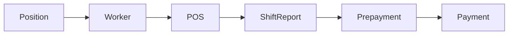

# HR — как это работает

Сначала сценарий для пользователя (ответы бизнеса). Затем — что считает код. Затем — где бизнес и код расходятся: **два подпункта, без выбора «правильной» стороны**.

## Сценарий для пользователя



ЗП можно провести без аванса: `ShiftReport → Payment`, минуя `Prepayment`.

### Кто что делает

- **HR** заводит работников АМС: карточку, должность, привязку к мойкам. Эти люди **не заходят в программу** — они нужны для отчётности и табеля.
- **Управляющий АМС** ведёт табель смен и формирует отчёты **аванс** и **ЗП**.

### Порядок

1. Сотрудник.
2. Должность и привязка к АМС.
3. Табель смен в разделе **Управление**.
4. Аванс по сменам месяца (можно не делать).
5. ЗП по сменам; если аванс уже сформирован — из полной ЗП вычитается выплаченный аванс.

ЗП можно сформировать **без аванса**.

### Ставки

Приоритет у настроек АМС: день/ночь по должности (**Стоимость смен** в профиле мойки). Если на мойке цена не заполнена — берётся дневной оклад / бонус с карточки работника.

Работник может работать на разных АМС с разным окладом. В итоге ЗП учитывается ставка **той смены** (той АМС, где смена была).

### Пустой месяц

Нет отчётов по сменам → сервер возвращает **пустой массив**. Это не ошибка расчёта.

### Аванс и ЗП

- Аванс раньше ЗП, если аванс делают.
- На одного сотрудника в конкретный месяц — **только один аванс и одна ЗП** (формулировка бизнеса).
- Премию, штраф и связанные поля заполняет управляющий. Комментарий не обязателен.

### Уже созданные выплаты и увольнение

- Уволенный остаётся во всех уже созданных отчётах. В **новые** смены его указывать нельзя.
- Уже созданные выплаты не меняются при смене должности / моек / окладов. Новые отчёты считаются по новым данным.

### Что не является правилом продукта

- Месячный оклад на сотруднике — устаревшее поле.
- Текст про «процент с автомобиля» / делёж между мойщиками — не актуален.
- Вкладка графика в профиле — на бизнес не влияет.

---

## Формулы кода

Источник payout смены: `shiftReport-calculate-daily-payout.ts`.  
Агрегат месяца: `shiftReport-calculation-payment.ts`.  
Calculate HR: `payment-calculate.ts`, `HrController` (`prepayment/calculate`, `payment/calculate`).

### Кто попадает в calculate

Работник организации, к чьим мойкам есть доступ у текущего пользователя.

- **Аванс:** нет **никакого** `HrPayment` за этот расчётный месяц.
- **ЗП:** нет `HrPayment` с типом `PAYMENT` за месяц (наличие аванса не исключает).
- В результат попадают только те, у кого есть смены: `WORKING` + `SENT` + `dailyShiftPayout ≠ null` за месяц.
- Нет таких смен → работника нет в ответе. Пустой набор → **`[]`**, не ошибка.
- Статус `DISMISSED` в фильтре calculate **не проверяется**.

### Выплата за одну смену (при отправке табеля)

Поведение сервера (бизнес ночные часы отдельно не формулировал):

- Ночная смена, если час начала в TZ мойки **`< 8` или `≥ 20`**. Нет времени начала → не ночная.
- `totalPercentage = Σ (вес параметра × вес оценки / 100)`
- База/бонус: ставка АМС день или ночь; если поле ставки пустое → `worker.dailySalary` / `worker.bonusPayout ?? 0`
- `dailyShiftPayout = round(base + bonus × totalPercentage / 100)`
- `monthlySalary` в формуле **нет**.

### Сумма за месяц

```
sum = Σ dailyShiftPayout по всем подходящим сменам месяца (все АМС)
```

Это поле уходит в аванс и в ЗП как «начислено по сменам».

Нюанс ответа calculate: колонки дневного оклада / бонуса для **отображения** берутся со **первой** смены с `posId` и только **дневных** ставок АМС.

### PREPAYMENT vs PAYMENT

| | Аванс | ЗП |
|--|--------|-----|
| Тип | `PREPAYMENT` | `PAYMENT` |
| Create | `prize = 0`, `fine = 0` | `prize` и `fine` обязательны в API |
| К выплате (отчёт / UI) | `sum` | `sum − prepaymentSum + prize − fine` |
| Безнал | нет | `totalFinal = то же − (virtualSum \|\| 0)` |

Комментарий в API ЗП необязателен.

### Повторный calculate и unique

У `HrPayment` **нет** `@@unique` на работника + месяц + тип.

- Повторный **calculate** после успешного create: работник скрыт фильтром «уже есть выплата».
- Повторный **POST create** через API: проверка «аванс уже есть» **закомментирована**; для ЗП нет проверки «уже есть PAYMENT».
- После **delete** фильтр снимается — calculate снова возвращает строку.

### Уволенный в табеле

`GET user/hr/workers` без `status` → сервер ставит `WORKS`. UI создания смены так и вызывает API → уволенного в списке нет.  
Create смены на сервере статус работника **не проверяет**.

---

## Расхождения бизнес ↔ код

Не выбираем сторону. В ТК проверять оба подпункта.

### Один аванс / одна ЗП в месяц

- **Бизнес:** на сотрудника в конкретный месяц — только один аванс и одна ЗП.
- **Код:** calculate прячет уже посчитанных. Повторный create через API возможен, unique нет. После delete снова calculate.

### Уволенный в новую смену

- **Бизнес:** в новые смены указывать нельзя.
- **Код:** UI табеля не показывает (дефолт `WORKS`). Серверного запрета на create смены нет.

### Сумма ЗП

- **Бизнес и код для `sum`:** совпадают — `Σ dailyShiftPayout` по сменам, ставка той АМС, где была смена (считается при Send).
- **Код, колонка «дневной оклад» в calculate:** ставка **первой** мойки за месяц, только день.

### Уже сохранённая выплата

- **Бизнес:** смена должности / моек / окладов не меняет уже созданные выплаты.
- **Код:** `HrPayment.sum` не пересчитывается. Отображение ставки в GET-отчёте может перечитываться с текущих данных (первая мойка, дневные ставки).

### Поля в UI, которые не правила продукта

- **`hr.if`** (текст про процент с автомобиля): в UI на создании сотрудника есть; правилом продукта не является.
- **`monthlySalary` / «Месячный оклад»:** в UI и в API есть; в формулах calculate/payout не используется.

### График

- Вкладка `?tab=sch`: мёртвый UI, не описывать как функцию.

### Ночь

- Только поведение сервера: час начала в TZ мойки `< 8` или `≥ 20`.
