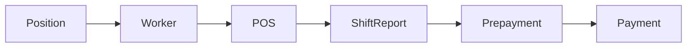

# HR — обзор для QA

В файлах `01`–`05`: сначала блок **«О странице»** (зачем / что менеджерит), затем тест-кейсы **Шаг → Действие → Ожидаемый результат**.

Сквозной смысл для пользователя и сверка с кодом: [00-how-it-works.md](./00-how-it-works.md).

## Назначение раздела

Раздел **HR** в админке Onvi Business — учёт **работников автомоек** (не пользователей программы) и выплаты: аванс и зарплата по сменам из табеля.

Корневой пункт меню `/Hr` требует план **SPACE | BUSINESS | CUSTOM** и permission на subject **`Hr`** (`manage` / `create` / `read` / `update`). Удаление выплат на экранах дополнительно проверяет `delete`.

Работники, которых заводят в HR, **не имеют доступа к программе**. Они нужны для отчётности и табеля.

## Источники домена

| Слой | Путь |
|------|------|
| Frontend UI | `onvi-monitoring-frontend/src/pages/Hr/` |
| Frontend API | `src/services/api/hr/index.ts` |
| Ставки смены на мойке | `src/pages/Pos/PosProfile/ShiftCost.tsx` |
| Табель (вход для расчёта) | `src/pages/Finance/Timesheet.tsx`, `ShiftCreateModal.tsx` |
| Backend (полный) | `C:\Bychenko\monitoring-system-backend` → `src/core/hr-core/` |
| Расчёт выплаты смены | `src/core/finance-core/shiftReport/shiftReport/use-cases/shiftReport-calculate-daily-payout.ts` |
| Агрегат за месяц | `src/core/finance-core/shiftReport/shiftReport/use-cases/shiftReport-calculation-payment.ts` |

## Жизненный цикл (как связаны сущности)

Порядок для пользователя:

1. HR заводит **должность**, затем **сотрудника**, привязывает к АМС.
2. Управляющий в **Управление → Табель учета рабочего времени** ставит смены.
3. Управляющий формирует **аванс** по сменам месяца (можно пропустить).
4. Управляющий формирует **ЗП** по сменам; если аванс уже выплачен — он вычитается.

ЗП можно сформировать без аванса. Связь `Prepayment → Payment` на схеме — типичный порядок, не обязательный шаг.

## Словарь сущностей

| Сущность | Простыми словами | Backend |
|----------|------------------|---------|
| **Сотрудник** | Человек на мойке: ФИО, должность, статус. Не логин в админку | `HrWorker` |
| **Должность** | Справочник должностей организации | `HrPosition` |
| **Привязка к АМС** | На каких мойках сотрудник может работать | `HrWorker.posWorks` ↔ `Pos` (`HrWorkerToPos`) |
| **Ставка смены** | День/ночь, база/бонус по должности на конкретной мойке | `PosPositionSalaryRate` |
| **Смена** | Строка табеля; при отправке считается выплата за день | `MNGShiftReport` (`dailyShiftPayout`) |
| **Аванс** | Выплата PREPAYMENT за расчётный месяц | `HrPayment` + `PaymentType.PREPAYMENT` |
| **Зарплата** | Выплата PAYMENT за расчётный месяц | `HrPayment` + `PaymentType.PAYMENT` |
| **Месячный оклад** | Поле на карточке сотрудника | `HrWorker.monthlySalary` — в UI есть, **правилом продукта не является** |
| **Дневной оклад / бонус на карточке** | Fallback, если на мойке ставка не заполнена | `dailySalary`, `bonusPayout` |
| **Премия / штраф / безнал** | Поля ЗП, заполняет управляющий | `prize`, `fine`, `virtualSum` |

## Доступы

### План подписки

`requiredPlanCodes: ['SPACE', 'BUSINESS', 'CUSTOM']` (`SPACE_AND_UP`).

### Permissions (subject `Hr`)

| Action | Типичное использование |
|--------|------------------------|
| `read` | Списки сотрудников, должностей, авансов, ЗП |
| `create` | Создание аванса и ЗП |
| `update` | Создание/правка сотрудника и должности, сохранение профиля |
| `delete` | Удаление авансов и ЗП (на экранах; в route родителя `delete` нет) |
| `manage` | Любое из перечисленного |

Табель: subject **`ShiftReport`**, не `Hr`.

## Организация и данные

Списки сотрудников и выплат завязаны на организацию сессии. Calculate аванса/ЗП берёт работников, к чьим мойкам у текущего пользователя есть доступ (`posWorks` ∩ права на POS).

Список `GET user/hr/workers` без `status` на сервере подставляет **`WORKS`**. Уволенные в обычном списке и в выборе смены табеля не видны.

## Query-параметры (сквозные)

| Param | Где | Зачем |
|-------|-----|-------|
| `city` | сотрудники, должности, создание аванса | город / placement |
| `placementId`, `hrPositionId`, `organizationId`, `name`, `page`, `size` | список сотрудников | фильтры и пагинация |
| `workerId`, `tab` | профиль | сотрудник и вкладка `info` / `addi` / `salary` / `poses` |
| `startPaymentDate`, `endPaymentDate`, `hrWorkerId`, `posId`, `page`, `size` | списки аванса и ЗП | период, сотрудник, мойка |
| `hrPositionId` | создание аванса/ЗП | фильтр должности при calculate |
| `posId`, `dateStart`, `dateEnd` | табель | мойка и период |
| `posId`, `tab` | профиль АМС | вкладка `shift` — стоимость смен |

`billingMonth` на экранах создания — состояние формы, не URL.

## Статусы (ориентиры)

| Объект | Значения | Подпись RU |
|--------|----------|------------|
| Сотрудник | `WORKS` / `DISMISSED` | Действующий / Уволен |
| Тип выплаты | `PREPAYMENT` / `PAYMENT` | аванс / зарплата |
| Смена в табеле (для расчёта) | `typeWorkDay = WORKING`, `status = SENT`, `dailyShiftPayout` не null | иначе смена в calculate не входит |

## Навигация

- **Сайдбар HR:** Сотрудники, Должности (визуальный разделитель `isHr`), Расчет ЗП, Аванс сотрудников.
- **Только по URL / из списка:** профиль, создание аванса, создание ЗП.
- **Смежный вход:** Управление → Табель учета рабочего времени; профиль АМС → Стоимость смен.

## Рекомендуемый порядок smoke

1. Должность → 2. Сотрудник → 3. Точки АМС + ставки смены → 4. Табель (если есть смены) → 5. Аванс → 6. ЗП.  
Отдельно: месяц без смен → calculate отдаёт пустой список (не ошибка).
