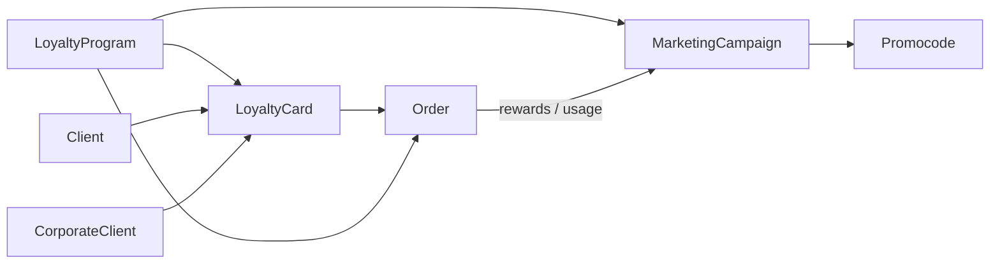

# Marketing — обзор для QA

В файлах `01`–`07`: сначала блок **«О странице»** (зачем / что менеджерит), затем тест-кейсы **Шаг → Действие → Ожидаемый результат**.

## Назначение раздела

Раздел **Маркетинг** в админке Onvi Business — операционный контур **программы лояльности** организации: кто клиенты, какие у них карты и балансы, как устроена программа (уровни, бонусы, мойки-участники), какие акции и промокоды действуют, какие заказы прошли и как сделать возврат.

Корневой пункт меню `/marketing` требует план **BUSINESS | CUSTOM** и permission `{ action: 'update', subject: 'LTYProgram' }`. Дочерние экраны могут требовать `read` / `manage` / тарифные фичи.

## Источники домена

| Слой | Путь |
|------|------|
| Frontend UI | `onvi-monitoring-frontend/src/pages/Marketing/` |
| Frontend API | `src/services/api/marketing/index.ts` |
| Backend (полный) | `/Users/dianasparynyak/Desktop/onvi_monitoring_backend` → `src/core/loyalty-core/` |

Stub в `Projects/OnviOne/onvi_monitoring_backend` не использовать.

## Жизненный цикл (как связаны сущности)

1. Организация создаёт или вступает в **программу лояльности** (owner / participant), настраивает уровни и публикацию.
2. Заводит **клиентов** и/или **карты** (вручную или импортом); карта — носитель баланса и операций.
3. На мойках проходят **заказы** (orders) по программе — начисления/списания, иногда награды кампаний.
4. **Кампании** и **промокоды** меняют условия скидок/бонусов для подходящих клиентов.
5. **Корпоративные клиенты** — B2B-обёртка над картами и ручными бонус-операциями (тариф).

## Словарь сущностей

| Сущность | Простыми словами | Backend (ориентир) |
|----------|------------------|-------------------|
| **Loyalty program** | Правила лояльности сети: уровни, benefits, POS-участники, publish | `loyalty/loyaltyProgram`, tiers, benefit |
| **Client** | Человек/юрлицо в базе лояльности (телефон, статус) | `mobile-user/client` |
| **Card** | Карта: номер, баланс бонусов, привязка к клиенту/корпу, уровень | `mobile-user/card`, bonus bank/oper |
| **Corporate client** | Компания-клиент: ИНН, карты, статистика, бонус-операции | `mobile-user/corporate` |
| **Order** | Заказ мойки в контексте программы (статусы, refund) | `order` |
| **Marketing campaign** | Акция: условия, actions, статусы, аналитика | `marketing-campaign` |
| **Promocode** | Код скидки/бонуса: standalone / campaign / personal | promocode use-cases в marketing-campaign |
| **Note** | Заметки менеджера по клиенту | `mobile-user/note` |

## Доступы

### План подписки

`requiredPlanCodes: ['BUSINESS', 'CUSTOM']`.

### Permissions (subject `LTYProgram`)

| Action | Типичное использование |
|--------|------------------------|
| `read` | Списки |
| `update` | Wizard'ы, профили, промокоды |
| `create` | Создание/вступление в программу (`Can`) |
| `delete` | Soft-delete клиента |
| `manage` | Сегменты (WIP) |

### Тарифные фичи

| Экраны | Features (`all`) | Без фичи |
|--------|------------------|----------|
| Corporate | `LTYProgram` + `CORPORATE_CLIENTS` | placeholder |
| Promo codes | `LTYProgram` + `ONVI` | placeholder |

## Организация и данные

Почти все запросы требуют `organizationId`. Без него списки часто не грузятся — это не обязательно баг API.

## Query-параметры (сквозные)

| Param | Где | Зачем |
|-------|-----|-------|
| `userId` | профиль клиента | ID клиента |
| `clientId` | профиль корп. клиента | ID corporate |
| `corporateClientId` | import | prefill |
| `marketingCampaignId`, `mode`, `step` | campaign wizard | |
| `loyaltyProgramId`, `mode`, `step` | loyalty wizard | |
| `loyaltyProgram` | cards | фильтр программы |
| `tab` | card detail | вкладка |
| `from` | назад | `orders` / `campaigns` |

## Статусы (ориентиры)

| Объект | Статусы |
|--------|---------|
| Client | `VERIFICATE`, `ACTIVE`, `BLOCKED`, `DELETED` (soft; карты → INACTIVE) |
| Loyalty program | `ACTIVE` / `PAUSE`; отдельно publish/unpublish |
| Campaign | `DRAFT` → `ACTIVE` → `PAUSED` / `CANCELLED` / `COMPLETED` (в т.ч. cron по датам) |
| Order | в т.ч. `COMPLETED`, `PAYED`, `POS_PROCESSED` — можно refund |
| Promocode | `isActive`; типы standalone / campaign / personal |

## Навигация

- **Сайдбар:** Клиенты, Корп. клиенты, Кампании, ПЛ, Пользователи (карты), Заказы, Промокоды.
- **Только по URL / из списка:** import, профили, wizard'ы, card detail, stats.
- **WIP:** segments (`Default` + NewSegment без API).

## Рекомендуемый порядок smoke

1. Программа лояльности → 2. Клиенты → 3. Карты → 4. Кампании → 5. Заказы → 6. Corporate/Promo (по тарифу).
